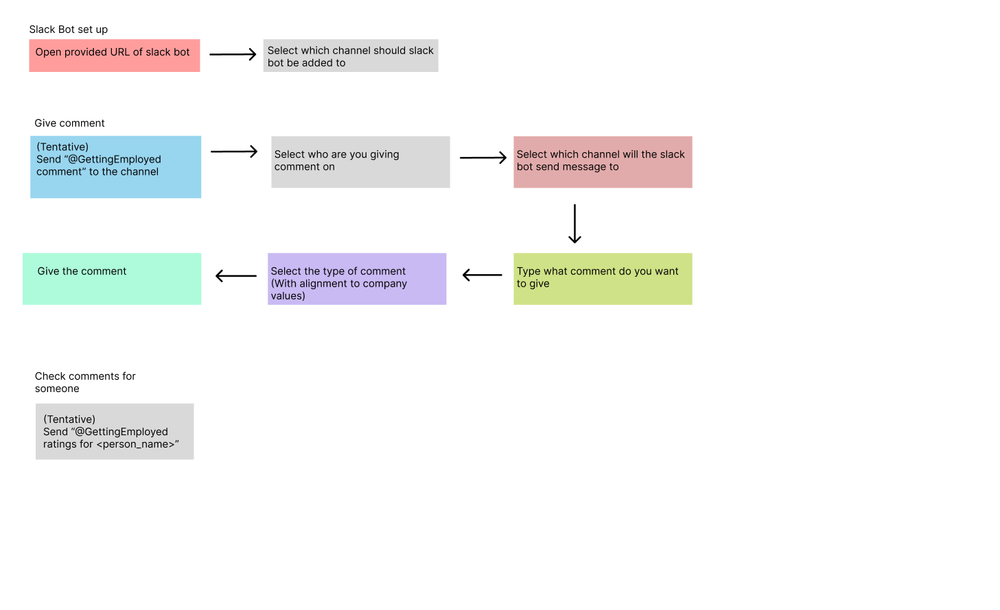
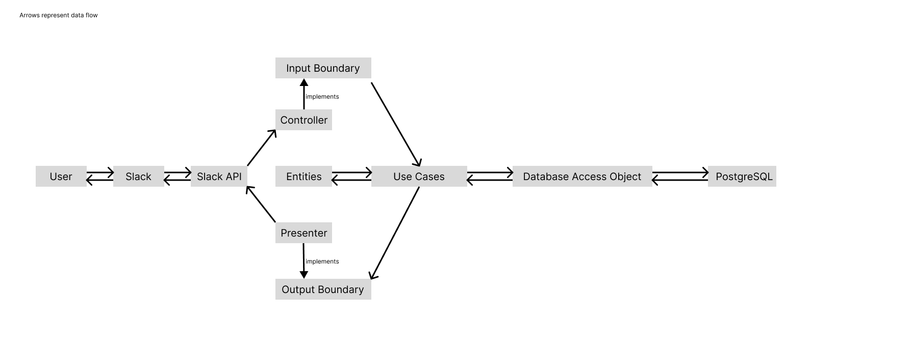
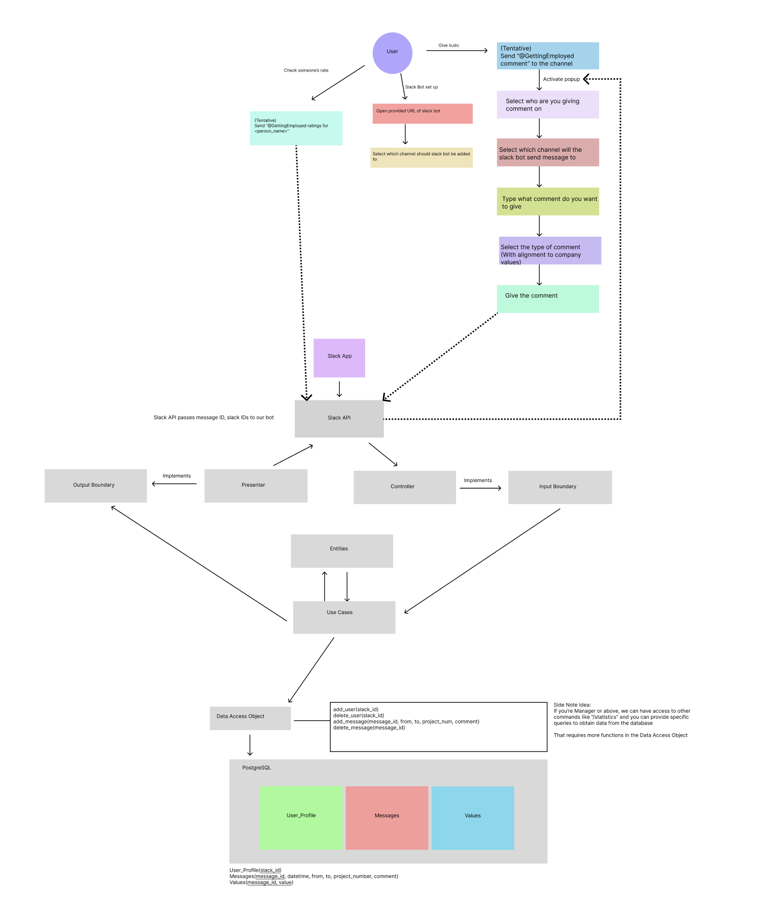
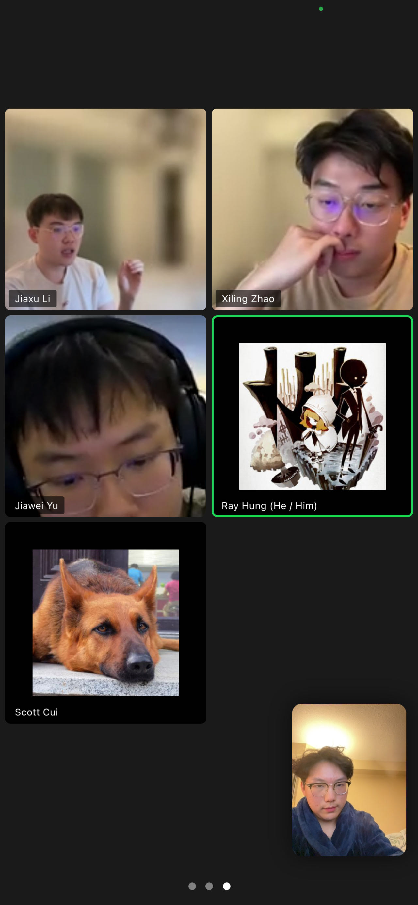

# Slack App / Getting Employed
> _Note:_ This document will evolve throughout your project. You commit regularly to this file while working on the project (especially edits/additions/deletions to the _Highlights_ section). 
 > **This document will serve as a master plan between your team, your partner and your TA.**

## Product Details

#### Q1: What is the product?

<!-- 
 Short (1 - 2 min' read)
 * Start with a single sentence, high-level description of the product.
 * Be clear - Describe the problem you are solving in simple terms.
 * Specify if you have a partner and who they are.
 * Be concrete. For example:
    * What are you planning to build? Is it a website, mobile app, browser extension, command-line app, etc.?      
    * When describing the problem/need, give concrete examples of common use cases.
    * Assume your the reader knows nothing about the partner or the problem domain and provide the necessary context. 
 * Focus on *what* your product does, and avoid discussing *how* you're going to implement it.      
   For example: This is not the time or the place to talk about which programming language and/or framework you are planning to use.
 * **Feel free (and very much encouraged) to include useful diagrams, mock-ups and/or links**.
-->

A Slack App that helps users to do various things, these include but not limited to:
- Send kudos using a form to a certain user
- Option to add user's alignment of company values in the kudos that are sent
- Ability to retrieve information of how much kudos are sent to a certain user and their statistics





#### Q2: Who are your target users?

Teams working in small organizations (less than 2000 people).

#### Q3: Why would your users choose your product? What are they using today to solve their problem/need?

<!--
 > Short (1 - 2 min' read max)
 * We want you to "connect the dots" for us - Why does your product (as described in your answer to Q1) fits the needs of your users (as described in your answer to Q2)?
 * Explain the benefits of your product explicitly & clearly. For example:
    * Save users time (how and how much?)
    * Allow users to discover new information (which information? And, why couldn't they discover it before?)
    * Provide users with more accurate and/or informative data (what kind of data? Why is it useful to them?)
    * Does this application exist in another form? If so, how does your differ and provide value to the users?
    * How does this align with your partner's organization's values/mission/mandate?
-->

Our product will be able to accomplish the following:
1. Allow users to efficiently acknowledge work done by other employees in the same team.
2. Makes users able to extend the functionalities of our product by configuring the App. 
3. Allow users to easily retrieve information about the kudos they have sent and received.
4. Allow organizations to incorporate their own values into the App, and use it to acknowledge their employees.

#### Q4: What are the user stories that make up the Minimum Viable Product (MVP)?

<!--
 * At least 5 user stories concerning the main features of the application - note that this can broken down further
 * You must follow proper user story format (as taught in lecture) ```As a <user of the app>, I want to <do something in the app> in order to <accomplish some goal>```
 * User stories must contain acceptance criteria. Examples of user stories with different formats can be found here: https://www.justinmind.com/blog/user-story-examples/. **It is important that you provide a link to an artifact containing your user stories**.
 * If you have a partner, these must be reviewed and accepted by them. You need to include the evidence of partner approval (e.g., screenshot from email) or at least communication to the partner (e.g., email you sent)
-->

1. As a manager of my company, I want to predefine a set of company values that I can use to acknowledge my employees. I will use the configuration feature in my application to define the company values.
2. As a leader of a team, I want to be able to acknowledge what my team members did. I will use the kudos feature in my application to send a kudos to my teammate.
This kudos will contain the name of the employee I sent to, my name, the company values that I have defined in the App earlier, and a message.
3. As a manager of a team, I want to view the amount of kudos that a certain employee has received in the previous month. I will use this number to determine which employee should receive a bonus for being a great addition to our team.
4. As a manager of a team, I want ot analyze the types of kudos that my team members have received. I will use this information to determine which company values are the most important to my team members. 
5. As an employee of a team, I want to request kudos from a specific manager because I have worked hard on a project with him/her. I will ask the application to send a notification that I requested for a kudos. 
6. As an employee of a team, I want to be able to view the kudos that I have received, and present it to another project manager to show that I am competent to undertake the newly proposed project. 

#### Q5: Have you decided on how you will build it? Share what you know now or tell us the options you are considering.

Technology Stack

- Python as the backend
- Slack Bolt SDK for Python as the entry point to Slack's API
- PostgreSQL with Psycopg2 for database (Tentative: Microsoft Azure)
- Docker for ease of deployment
- Slack's UI as the frontend

----
## Intellectual Property Confidentiality Agreement
<!--
Note this section is **not marked** but must be completed briefly if you have a partner. If you have any questions, please ask on Piazza.

**By default, you own any work that you do as part of your coursework.** However, some partners may want you to keep the project confidential after the course is complete. As part of your first deliverable, you should discuss and agree upon an option with your partner. Examples include:
1. You can share the software and the code freely with anyone with or without a license, regardless of domain, for any use.
2. You can upload the code to GitHub or other similar publicly available domains.
3. You will only share the code under an open-source license with the partner but agree to not distribute it in any way to any other entity or individual. 
4. You will share the code under an open-source license and distribute it as you wish but only the partner can access the system deployed during the course.
5. You will only reference the work you did in your resume, interviews, etc. You agree to not share the code or software in any capacity with anyone unless your partner has agreed to it.

**Your partner cannot ask you to sign any legal agreements or documents pertaining to non-disclosure, confidentiality, IP ownership, etc.**

Briefly describe which option you have agreed to.
-->

We have agreed to the following option as our partner required. 

> You will only reference the work you did in your resume, interviews, etc. You agree to not share the code or software in any capacity with anyone unless your partner has agreed to it.

We have agreed on this option as our partner is looking forward to use this project as a tool to organize and manage smaller teams, and maybe his own startup in the future. 

----

## Teamwork Details

#### Q6: Have you met with your team?

Since we all know each other very well, we hang out frequently together.



Fun Facts:

1. Ray Hung can easily get a 90+ exam grade with a 1-hour review. 
2. We have at least 3 students that knows how to solve a Rubik's cube. Including one speed-cuber that can solve it in under 20 seconds consistently!
3. We have 3 students that can play the piano.
4. There is only 1 senior student in our team, and he is the one out of two students that has a driver's license.

#### Q7: What are the roles & responsibilities on the team?

<!--
List each team member and:
 * A description of their role(s) and responsibilities including the components they'll work on and non-software related work
 * Why did you choose them to take that role? Specify if they are interested in learning that part, experienced in it, or any other reasons. Do no make things up. This part is not graded but may be reviewed later.
-->

1. Ray Hung - Leader, Backend Developer, Scrum Manager, Partner Liaison
    - He is the leader of the team (Has experience in leading teams)
    - He will be responsible for the overall progress of the project, and ensuring that it meets requirements
    - He will also be responsible for the backend development of the project that is related to Slack's API (Has experience writing a Discord bot)
    - He will also be the partner liaison (As the leader)
2. Scott Cui - Co-Leader, Backend Developer, Partner Liaison
    - He will also lead the team in most aspects (Had experience in leading team)
    - He will be more focus on managing architecture and details of the programming parts of the project (Had experience in planning out program architecture).
    - He will manage and clean the overall code base.
    - He will also be responsible for software deployment (Interested in learning software deployment)
3. Will Zhao - Backend Developer, Quality Assurance Tester
   - He will serve as a backend developer and will primarily be responsible for refining and organizing the code and streamlining the workflow for the entire project. (He likes to organize stuff)
   - He will ensure that the implemented feature works as intended and meets the specified requirments. 
4. Arthur Li - Frontend Developer, Quality Assurance Tester
   - He will be responsible for the frontend development of the project, especially the ones related to the Slack's API (Has prior experience in frontend development in CSC309)
   - He will main decide on how the frontend will look like and how it will interact with the backend in the project
   - He will also be responsible for testing the implemented features and ensure there are no quality issues.
5. Jiawei Yu - Backend Developer, Database Manager
    - He will be responsible for some parts of the backend development of the project, especially the ones with the database (Has experience in database management)
    - He chooses to take this role as he likes managing databases and understanding the back scene of a project seems really enjoyable to him

#### Q8: How will you work as a team?

Any meetings required will be held either in person or Zoom. 

However, meetings are not necessary, as we will communicate through Slack and Notion on a frequent basis (More than 5 times a week).

Meetings with project partner will be conducted through Slack as well, as the project partner prefers communication on Slack instead of a meeting. 

#### Q9: How will you organize your team?

We used Notion to manage tasks, schedule meetings, post announcements, and document information. 

- We prioritize our tasks with the help of the Notion task board. It's flexible and we can easily assign tasks to specific people.
- Different types of work have different criteria for determining the status. 
    - Programming works are completed once the pull requests are merged.
    - Meetings are completed once we reach our goal for that meeting.
    - Assignments/Deliverables are completed once we submit it.
    - Other tasks can be generalized in similar ways.

We will also utilize Slack to test out our bot and to communicate with our partner.

We will also use the GitHub Project to better manage our codebase.

#### Q10: What are the rules regarding how your team works?

**Communications:**

 * We expect that we will meet weekly to discuss updates on everyone's ends. 
    * For daily communications, we will use Slack.
    * For weekly meetings, we will host them on Zoom.

 * We will try our best to update with our partner once a week.
    * We will post updates on Slack and Notion. 
    * We will attempt to update our partner on our recent progress and ask for feedback.

**Collaboration:**

 - As we are close friends in our lives, we will hold each other accountable for completing assigned tasks. 
 - Team leads - Ray and Scott will act as moderators in this case to ensure that everyone is on track.
 - Ray will also act as the Scrum Manager to ask everyone to submit updates on a weekly basis to ensure that we are on track. 
 - If some member of our team does not contribute or is not responsive, we will first try to communicate with them and understand the reason behind it, and try our best to help him overcome it. If the problem persists, we will contact the TA for help.
