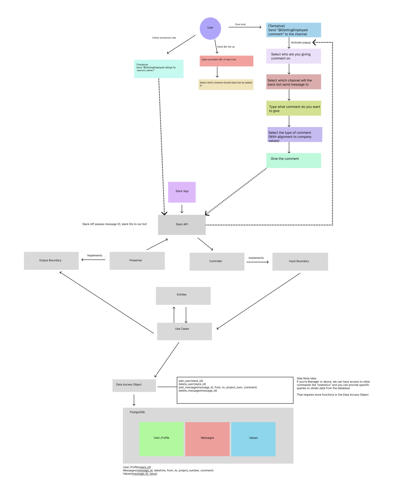

# Summary of the software

## Description

Our application is a Slack Bot that will help in management of teams in multiple ways. The bot will have multiple features that will help in the management of teams (which can be extended easily).
The problem we are trying to solve is to create a "helper" that can help manage the teams in Slack better.
For example, one feature that we are intending to complete is the feature to send a "kudos" to another user, which is like a "thank you" message.
This command can be used by Managers of a certain work space to ensure that an employee does receive acknowledgements when they do something beyond expectations.

## Existing Software

Our software is designed from the ground up without deriving from any existing partner software or previous CSC301 projects. Every line of code, feature, and interface element is a product of our team's own vision and expertise. Therefore, each sub-group will be creating their own part from scratch.

# Subgroup formation

We have decided to split ourselves into 3 subgroups (Backend, Database, Logging and Docker), with 1-2 people in each group. 

From the diagrams shown above, we can clearly indicate that we need a Database component and a Backend component to setup our application.
Therefore, it follows that we are splitting into these 2 subgroups with 2 people each. 

The main objective of the backend group is to develop handler logic with the Slack API, which ensures that the interactive features of our Slack App can be used by the users. 
To function as a complete application, a static interactive Slack App cannot hold any persistent information, therefore, we also need the database group to come up with a scheme that can store information in a persistent manner.
In this case, the database group will be responsible for the database management of our application, which will be used to store and retrieve the information that we will obtain from the backend component.

Lastly, as we only have 5 members, we have decided to let the last group member work on a relatively simple yet effective task, which is to figure out how to setup a common environment for everyone. 
With this task in mind, we have assigned the last group the task of figuring out Docker and Logging, which can be used to aid development in the long run. 

## Subgroup 1 - Frontend Development and Slack API

The goal for this sub team is to provide a user-friendly interface for users to interact with the Slack App.
We used Slack's API libraries to implement the frontend logic of our Slack App. Specifically, we used the `Block Kit Builder` provided by Slack's API to build the UI of our Slack App, reflected in the window components when slash commands are invoked.
Then, we used the Slack's Library API to implement the reaction logic of our Slack App. Specifically we used the `Slack Bolt` library (Slack SDK in Python) to handle the requests from Slack and provide responses.

## Subgroup 2 - Database Management

The goal for this subgroup is to provide reliable and efficient database access to support subgroup1's operations.
We hosted our PostgreSQL database on Microsoft Azure and have functions needed by the subgroup1 implemented by Python with the `psycopg2` library.
To adhere to the clean architectural design of our project, we abstract the API for subgroup1 and implemented the details separately. In this way, we may potentially add implementations of other databases/data persistence format.
Also, we designed the relations carefully to maximize extensibility and minimize coupling. Therefore, we would easily add new relations/data in the future.

## Subgroup 3 - Logging and Docker

For the Logging and Docker subgroup, our main goal is to ensure that our application can be monitored in a controlled manner, and that our application can be deployed easily.
For the logging component of this subgroup, we will be utilizing the Python logging library with a pre-defined logging config file. This will ensure that our logs will be outputted as a file in the `logs` directory with information of how our application is running. 
For the Docker component of this subgroup, we will be utilizing Docker to containerize our application to allow easy deployment. With the help of Docker, we can skip the process of setting up the environment for our application, and just run the application using Docker. 
This will allow the group to focus on the development of the application, and not worry about the environment that the application is running on. 
With these peripheral setup done, our group will be able to identify bugs and develop in a more bug-free environment. 
