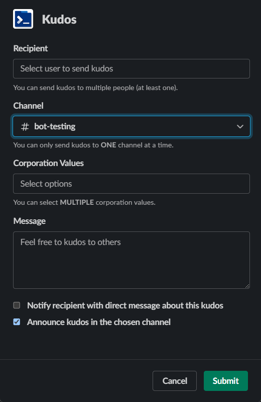

# Team Collab 

Brief project description and purpose for future developers. 

## Table of Contents
- [Introduction](#introduction)
- [Features](#features)
- [Getting Started](#getting-started)
  - [Prerequisites](#prerequisites)
  - [Installation](#installation)
- [Usage](#usage)
- [Project Structure](#project-structure)
- [Contributing](#contributing)
- [Testing](#testing)
- [Deployment](#deployment)
- [Technologies Used](#technologies-used)
- [License](#license)
- [Acknowledgments](#acknowledgments)

## Introduction

This project aims to build an app that works smoothly with Slack/Teams, promoting teamwork by recognizing achievements (kudos). The target users for this product are workspaces with fewer than 2000 people.

---
## Features

1. Customize Corporate Values for a workspace. The project supports admin-check, only admins of a workspace is permitted to modify corporation values. 
2. Acknowledge colleagues with kudos, and align each kudos with one or more corporate values.
3. Analyze an employee's statistics, including the number and reasons for the kudos received within a specified time frame. Only admins are permitted to view others' stats. 

---
## Getting Started

Explain how to set up the project locally for development. Include step-by-step instructions to help future developers get up and running quickly.

### Prerequisites

List any software, tools, or dependencies that need to be installed before setting up the project.

### Installation

Provide detailed installation instructions, including any setup scripts or commands that need to be executed.

---
## Usage
(After installing the app)

An admin of the workspace can:
1. Customize Corporation Values:
   1. Send `/kudos_customize` in the chat
   2. 
2. View other employees' stats:
   1. Send `/kudos_overview ` in the chat
   2. 

Any user in the workspace can:
1. Send Kudos:
   1. Send `/kudos` in the chat. A window should be popped up
   2. Select recipients (one or multiple)
   3. Select corporation values associated with the kudos
   4. Type messages to the recipients, along with reasons for the kudos
   5. Select if announce this kudos publicly in this channel, and if notify recipients with direct message this kudos. 

  

---
## Project Structure

Outline the structure of the project. Describe the purpose of each major directory and important files. This section provides a roadmap for developers to navigate the codebase.

This project can mainly be divided into 3 parts, in the order of the dataflow: Slack, Backend and database

### Slack

### Backend

### Database
This section introduces the design of our database component. We choose to use Microsoft Azure to host our database and PostgreSQL as our main language. We will introduce below the design of our tables and the functionalities we currently support 
#### Table Design
To support multiple workspaces, we choose to create a new *schema* for each workspace. For each schema, we have the following tables and constraints: 

##### 1. Table: `users`

- **Columns:**
  - `slack_id` (VARCHAR(20), Primary Key): Unique identifier for Slack users.
  - `name` (TEXT): Name of the user.

##### 2. Table: `channels`

- **Columns:**
  - `id` (VARCHAR(20), Primary Key): Unique identifier for channels.
  - `name` (TEXT): Name of the channel.

##### 3. Table: `messages`

- **Columns:**
  - `id` (VARCHAR(50))
  - `time` (TIMESTAMP): Timestamp of the message.
  - `from_slack_id` (VARCHAR(20), Foreign Key): References `users` table for sender.
  - `to_slack_id` (VARCHAR(20), Foreign Key): References `users` table for recipient.
  - `channel_id` (VARCHAR(20), Foreign Key): References `channels` table for the channel.
  - `text` (TEXT)

- **Primary Key:**
  - Composite key on `(id, from_slack_id, to_slack_id)`.

##### 4. Table: `corp_values`

- **Columns:**
  - `id` (SERIAL, Primary Key): Auto-incremented identifier.
  - `corp_value` (TEXT): Corporate values.

##### 5. Table: `kudos`

- **Columns:**
  - `message_id` (VARCHAR(30), Primary Key): Unique identifier for the kudos message.
  - `corp_value_id` (INTEGER, Foreign Key): References `corp_values` table.

**Note:**
- Foreign key constraints are established for referential integrity.
- Appropriate actions on delete (`NO ACTION`, `CASCADE`) are specified based on the relationships.
- Column data types and constraints are provisionally set; consider adjustments based on specific requirements and constraints.
- Every id except the id for `copr_values` is generated by slack and is unlikely to collide. The id for `corp_values` is automatically generated by a sequence. 
- The primary key of `messages` is set to a couple since we want to enable multiple recipients.

#### Code Design
1. To establish a connection with our database, use the `get_DAO()` function available in `__init__.py`. This practice ensures the prevention of creating multiple connections to our database.

2. The `DAObase` is an interface that any Data Access Object must adhere to. For specific behaviors expected from a `DAObase` instance, please refer to the documentations in `main/database/dao_base.py`.

3. The `DAOPostgreSQL` class is an implementation of the `DAObase` interface using PostgreSQL. It is very important to modify the default parameters within the `DAOPostgreSQL.__init__` with your individual account information after setting up your Azure account.

4. If there is necessary modifications to the database design, make the required changes in `init.sql` file and remember to also change relevant sections of `dao_psql.py`. This ensures consistency between the database design and its corresponding implementation.

## Contributing

Explain how others can contribute to the project. Include information about the contribution process, coding standards, and any guidelines for submitting issues or pull requests.

### Database 
1. Multiple injections in the functions of DAOPostgreSQL stem from unforeseen behaviors in the _select_schema helper functions. Invoking this helper function tends to induce instability in the connection to Azure, leading to prolonged query times and potential non-responsiveness. A team member attempted to address this issue by committing the current session after selecting the schema; however, this solution fails to pass the pytest.

2. Add an organization goal component to or project. It should behave like company values, but its cope is only restricted in small teams, and they might be more frequently changed by new goals. Think of them as short term tasks. Admins of a workspace/channel should be able to modify them just like company values. 

3. Enhance the robustness of the code by addressing additional edge cases and unexpected behaviors triggered by unusual inputs or connection instability. This proactive approach will contribute to a more resilient and reliable system, capable of handling diverse scenarios effectively.

## Testing

Presently, our testing framework exclusively comprises unit tests for the database. Each test involves the creation and subsequent teardown of a new schema. It's crucial to note that these tests address only the fundamental aspects of the functionalities; they lack comprehensiveness. Nevertheless, the success of these tests is a prerequisite before implementing any modifications to the database components.

To streamline the testing process, a team member has configured GitHub Actions to automatically run these tests whenever a new push is made to the main branch. This automation ensures continuous validation of the database functionalities, contributing to the overall reliability of our system.

## Deployment

Provide guidance on deploying the project to production. Include any specific configurations or considerations for deployment environments.

## Technologies Used

List the technologies, frameworks, and tools used in the project. This section helps developers understand the tech stack.

## License

Specify the project's license. This informs future developers about the terms under which they can use, modify, and distribute the project.

## Acknowledgments

Express gratitude to individuals or organizations that contributed to the project. This can include mentions of libraries, tools, or resources used.
